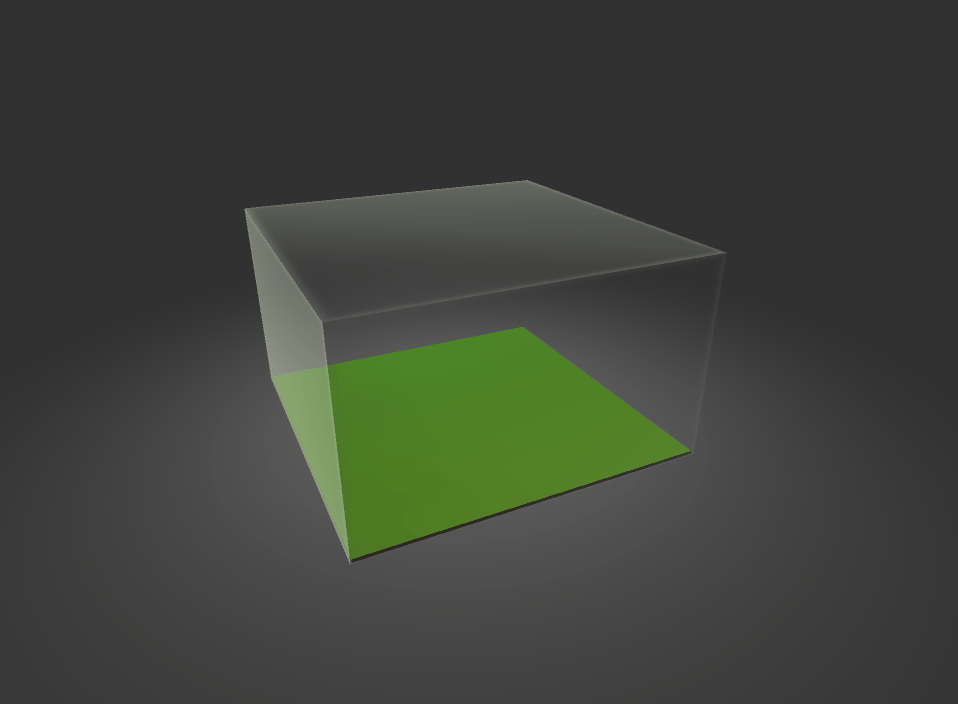

# TP Terrain

L'objectif de ce TP est de créer le système ci-dessus.  Lors d'un appuis sur espace, un nouveau terrain est généré. Pour réaliser cela, il va falloir générer un mesh et lire une heightmap.

Une heightmap est une texture en noir et blanc. Le niveau de gris d'un pixel correspond à l'altitude en ce point. Le noir signifie que le point est bas, et le blanc qu'il est haut.

## Echauffement

1. Faire en sorte que l'on puisse faire tourner la camera autour de la scène à l'aide des flèches du clavier.

## Génération du Mesh

On travaille dans le script __*GenerateMeshFromHeightMap*__. Ce script contient des fonctions qu'il va falloir remplir pour générer un mesh à partir d'une heightmap.

1. Remplir la fonction __*GeneratePointsFromHeightMap*__. Cette fonction doit générer tous les vertices du mesh et les retourner sous forme d'un tableau de Vector3[].
	1. Dans un premier temps, on veut générer une grille de points de taille 1. Il faut pour cela determiner l'index du vertex en fonction de ses coordonnées x et y ainsi que sa position en x et z.
	1. Determiner la position en hauteur (Y) basée sur la heightmap. Si le pixel est blanc, sa hauteur est de 1. Si le pixel est noir, sa hauteur est de 0.

1. Remplir la fonction __*GenerateTriangles*__. Cette fonction doit Créer les triangles qui relient les points entre eux et les retourner sous forme d'un tableau de int[]. On parcourt chacun des quads (formés par 4 vertices) pour ajouter 2 triangles chacun, selon la configuration suivante :

## Génération de Heightmaps

On veut créer un script qui permette de générer une heightmap aléatoire.

1. Créer une fonction qui produise une texture à partir de Mathf.PerlinNoise.
2. Se servir de cette texture dans le composant __*GeneratePointsFromHeightMap*__ lorsqu'on génère le mesh.
2. Affiner cette texture en ajoutant plusieurs couches de PerlinNoise de différentes fréquences et amplitudes pour obtenir une heightmap plus naturelle.

## Morphing

On travaille dans le script __*MorphTerrain*__. Il doit gèrer une animation de transformation du terrain. Lorsque l'on appuie sur une touche, le terrain s'écrase, change, puis grandi de nouveau.
1. Faire en sorte que cette coroutine réduise la *localscale* du *transform* en y jusqu'à une très petite valeur (on ne va pas jusqu'à 0 pour garder l'objet visible, à 0 il deviendrait invisible), puis l'agrandisse de nouveau. On veut obtenir le résultat suivant :

**Note :** Pour obtenir une animation plus agréable, on peut utiliser *Curves.QuadEasyInOut()* à la place d'une éventuelle utilisation de *Mathf.Lerp()* (exactement de la même manière).

2. Rendre le nouveau *localscale.y* aléatoire après chaque appui de la touche espace (l'objet change de taille aléatoirement).
3. Au moment ou le localscale.y est le plus petit, générer une nouvelle heightmap à afficher (pour changer la forme du terrain).
